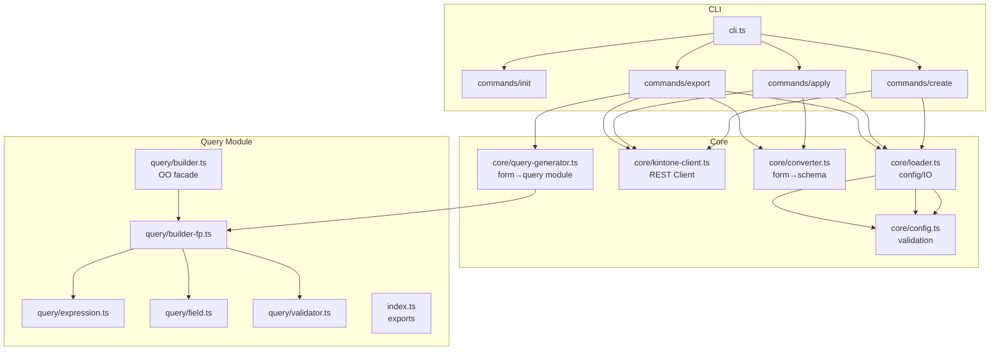
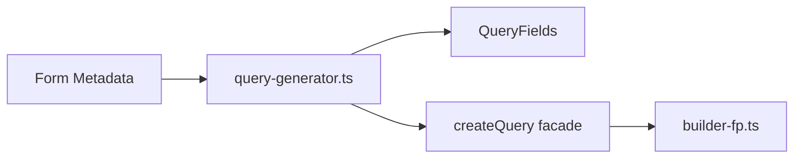

# アーキテクチャ

本プロジェクトは Functional Core, Imperative Shell を採用しています。

## 全体アーキテクチャ（俯瞰）

## レイヤ構成

- Functional Core（純関数・テスト容易・型安全）
  - `src/query/expression.ts`: 式ADTと論理結合子（and/or/not/toString）
  - `src/query/builder-fp.ts`: 関数型ビルダー（不変なQueryState + 純関数）
  - `src/query/field.ts`: 不変オブジェクトのフィールドAPI（Class非依存）
  - `src/query/validator.ts`: 純粋なバリデーション（深さ/長さ）
- Imperative Shell（副作用）
  - `src/cli.ts`, `src/commands/*`: CLI統合・FS/ネットワークI/O
  - `src/core/query-generator.ts`: FPファサードを使うクエリモジュールを生成

## クエリビルダー

- 推奨: FP API
  - `createQueryState`, `setWhere`, `appendOrder`, `withLimit`, `withOffset`, `setValidationOptions`, `build`
- 互換: OOファサード
  - `src/query/builder.ts` はFPコアの薄いラッパ（メソッドチェーンを維持）

## フィールドAPI

- `create*Field` ファクトリで不変オブジェクトを返し、各メソッドは副作用なしで Expression を返します
- 内部実装は Class を用いません

## バリデーション

- `validator.ts` の純関数で深さ/長さを検証し、FP/OO双方から利用

## 生成器

- `src/core/query-generator.ts` は FP API をimportし、使いやすい `createQuery()` ファサードを公開

### 生成器の補足

- 未サポートフィールドは生成物から除外し、警告コメントを出力します。
- `--include-subtable=false` を明示した場合、`SUBTABLE` は完全に無視し、コメントも出力しません。
- `--include-related` 指定時は `REFERENCE_TABLE` の `displayFields` だけを `createTableSubField('親.子')` で最小公開します（`in/not in` のみ）。

## 移行ノート

- 既存のOOメソッドチェーンはそのまま利用可能
- 新規コードでは合成性とテスト容易性の観点からFP APIの利用を推奨
- Effect-TS統合の高度なサンプル（例: `buildQueryEffect`, `validateExpression` のEffect版）は現時点では未実装です（将来計画）。
