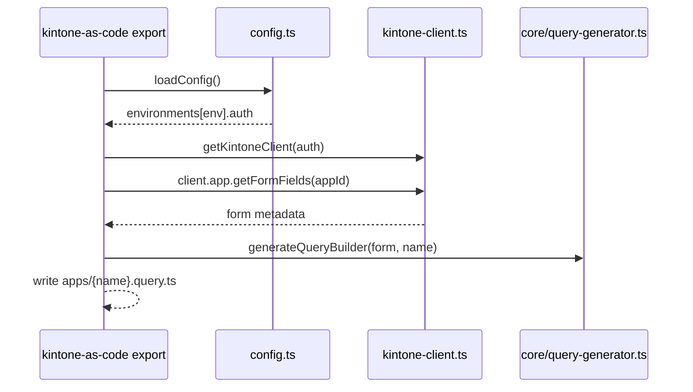

# CLI ガイド

## init

```bash
kintone-as-code init [options]

オプション:
  -f, --force        既存ファイルを上書き
  --no-esm-rewrite   既存の package.json を ESM に書き換えない（CJS 互換導入向け）
```

注: 既定では `init` はプロジェクトを ESM 前提（`type: module`）に整えます。CJS 互換を維持したい場合は `--no-esm-rewrite` を指定してください。

## export

```bash
# デフォルトでは query / record-schema も生成
kintone-as-code export --app-id 123 --name sales

# 生成のON/OFF（後方互換の --with-* も可）
kintone-as-code export --app-id 123 --name sales --no-query --no-record-schema

# サブテーブル/関連レコードの限定公開（in/not in のみ）
kintone-as-code export --app-id 123 --name sales \
  --include-related \
  --include-subtable
```

注: クエリビルダーは生成物（`apps/{name}.query.ts`）の一部であり、パッケージの公開APIではありません。公開APIはFPのみです。



## apply

```bash
kintone-as-code apply --schema apps/sales.schema.ts --env dev
# or
kintone-as-code apply --app-id 123 --schema apps/sales.schema.ts --env dev
```

## create

```bash
kintone-as-code create --schema apps/sales.schema.ts --name "Sales Copy" --space 100 --thread 200
```
