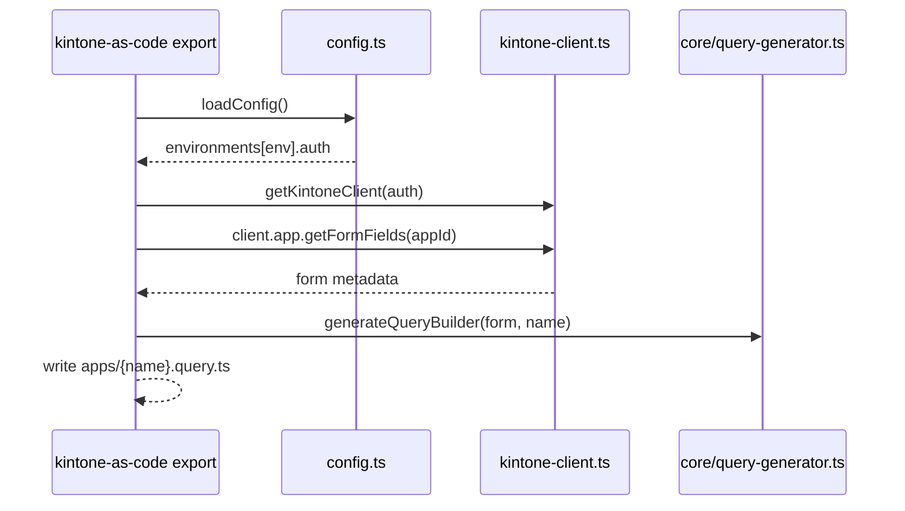

# CLI ガイド

## export
```bash
kintone-as-code export --app-id 123 --name sales --with-query --with-record-schema
kintone-as-code export --app-id 123 --name sales --no-query --no-record-schema
```



## apply
```bash
kintone-as-code apply --schema apps/sales.schema.ts --env dev
# or
kintone-as-code apply --app-id 123 --schema apps/sales.schema.ts --env dev
```

## create
```bash
kintone-as-code create --schema apps/sales.schema.ts --name "Sales Copy" --space 100 --thread 200
```
