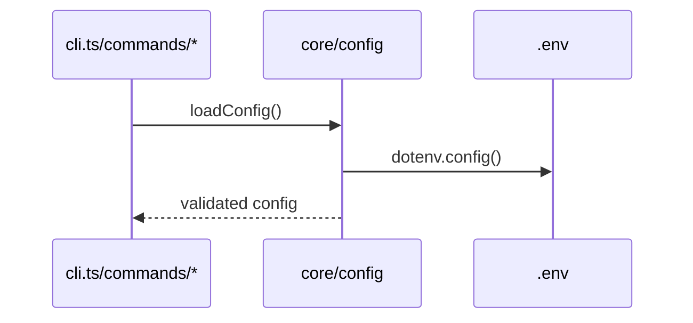

# 設定ガイド（config）

## 環境変数
`.env` に以下を設定します。

```bash
KINTONE_BASE_URL=https://your-domain.cybozu.com
KINTONE_USERNAME=your-username
KINTONE_PASSWORD=your-password
```

- 本プロジェクトは **APIトークン認証を非対応** とし、ユーザID/パスワードに統一しています
- `dotenv` によって自動読み込み（`src/core/config.ts`, `src/core/kintone-client.ts`）

## 設定ファイル（kintone-as-code.config.js）
`default` と `environments` を持つ単純な構造です。dev/prod いずれもユーザ/パスワード方式を使用します。

```javascript
export default {
  default: 'production',
  environments: {
    production: {
      auth: {
        baseUrl: process.env.KINTONE_BASE_URL,
        username: process.env.KINTONE_USERNAME,
        password: process.env.KINTONE_PASSWORD,
      },
    },
    development: {
      auth: {
        baseUrl: process.env.KINTONE_BASE_URL,
        username: process.env.KINTONE_USERNAME,
        password: process.env.KINTONE_PASSWORD,
      },
    },
  },
};
```

## バリデーション
`src/core/config.ts` で Effect-TS の Schema によりランタイム検証を行います。

- `auth.baseUrl`/`username`/`password` はすべて必須
- `default` が `environments` のキーに含まれていること

## ロードフロー（Mermaid）

