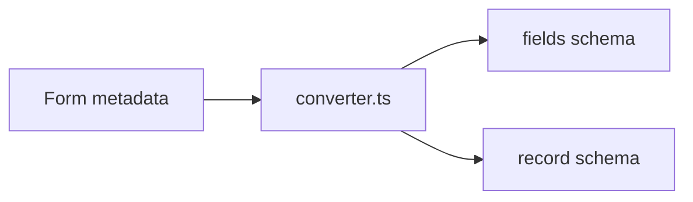

# 生成（converter とレコードスキーマ）

## 役割
- `src/core/converter.ts`: kintoneのフォーム定義（Form APIレスポンス）から **フィールド定義** と **アプリスキーマ** を出力
- `generateStaticRecordSchemaCode`: フィールド定義から **静的レコードスキーマ** を出力

## 出力テンプレート
- `defineAppSchema` を使用
- アプリIDは `utils/app-ids.ts` の `APP_IDS` から参照

```ts
import { defineAppSchema } from 'kintone-as-code';
import { APP_IDS } from '../utils/app-ids.js';

export default defineAppSchema({
  appId: APP_IDS.MY_APP,
  name: 'Exported App',
  description: 'This schema was exported from kintone.',
  fieldsConfig: appFieldsConfig
});
```

## レコードスキーマの生成
`generateStaticRecordSchemaCode` は Effect-TS の `Schema` を用いた静的スキーマを出力します。

- `decodeKintoneRecord` により **空値の正規化** を実施
- `Schema.Struct` により **型安全な検証** を実施



## 注意点
- SUBTABLE は配下の子フィールドをUnionして型表現
- 未対応フィールドはコメントで警告付与
- 生成物は `apps/{name}.schema.ts` / `{name}.record-schema.ts` に出力
