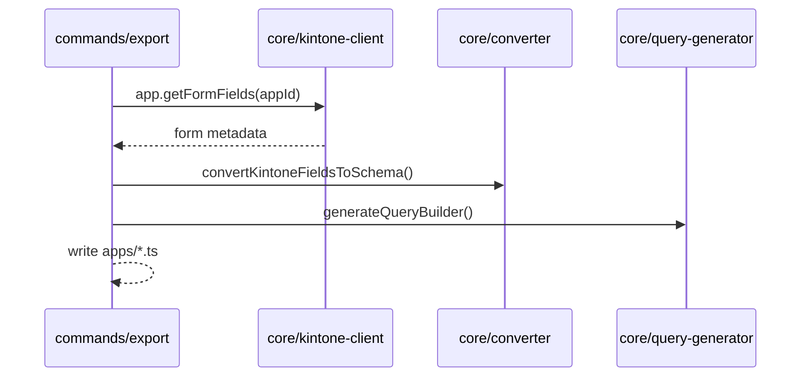
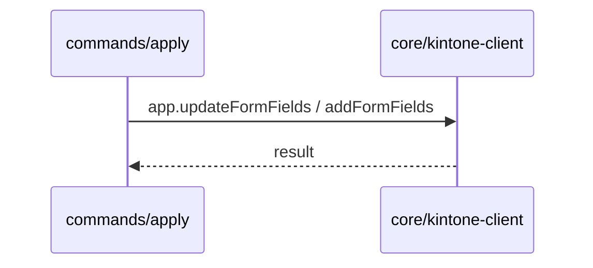
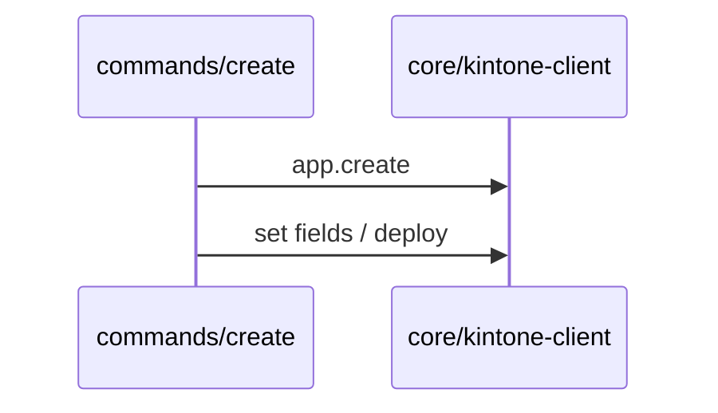

# Export / Apply / Create

## Export
- フォーム定義の取得 → 生成（フィールド/レコードスキーマ/クエリ）
- 主要ファイル: `commands/export.ts`, `core/kintone-client.ts`, `core/converter.ts`, `core/query-generator.ts`

## Apply
- 既存アプリへのスキーマ適用（フィールド追加/更新）
- 主要ファイル: `commands/apply.ts`, `core/kintone-client.ts`

## Create
- スキーマから新規アプリ作成（スペース/スレッドは必要に応じて）
- 主要ファイル: `commands/create.ts`, `core/kintone-client.ts`

