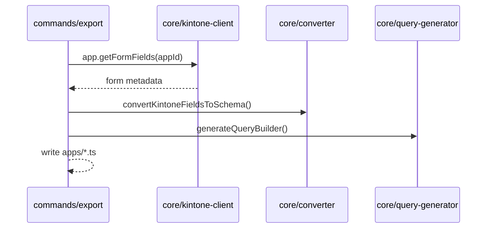
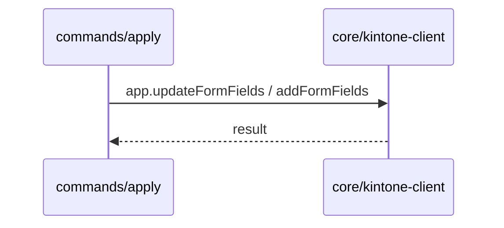
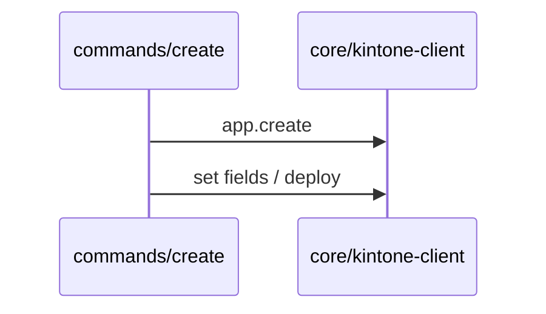

# Export / Apply / Create

## Export

- フォーム定義の取得 → 生成（フィールド/レコードスキーマ/クエリ）
- 主要ファイル: `commands/export.ts`, `core/kintone-client.ts`, `core/converter.ts`, `core/query-generator.ts`



## Apply

- 既存アプリへのスキーマ適用（フィールド追加/更新/デプロイ）
- 主要ファイル: `commands/apply.ts`, `core/kintone-client.ts`



### 注意点

- 更新不可フィールド（システム項目）はスキップされます（実装参照: `commands/apply.ts`）
  - `RECORD_NUMBER`, `CREATOR`, `CREATED_TIME`, `MODIFIER`, `UPDATED_TIME`, `STATUS`, `STATUS_ASSIGNEE`, `CATEGORY`
- サブテーブルの「子フィールド追加」はデフォルトでは自動追加しません（検知するとログ警告）。`--add-subtable-child` を付けると、検出した子フィールドを追加します（実験的）。

## Create

- スキーマから新規アプリ作成（スペース/スレッドは必要に応じて）
- 主要ファイル: `commands/create.ts`, `core/kintone-client.ts`

## 実運用のベストプラクティス

- `export` で生成した `apps/*.schema.ts` をGit管理し、PRレビューで差分確認
- `apply` はCIから実行して、環境ごとに `--env` を切替
- アプリIDは `utils/app-ids.ts` に集約（`export` 時に自動更新）。レビューで変更を可視化

### CIの最小例（GitHub Actions）

```yaml
name: Apply Schema
on:
  workflow_dispatch:
jobs:
  apply:
    runs-on: ubuntu-latest
    steps:
      - uses: actions/checkout@v4
      - uses: actions/setup-node@v4
        with:
          node-version: 20
      - run: npm ci
      - run: npm -g i kintone-as-code
      - run: |
          echo "KINTONE_BASE_URL=${{ secrets.KINTONE_BASE_URL }}" >> .env
          echo "KINTONE_USERNAME=${{ secrets.KINTONE_USERNAME }}" >> .env
          echo "KINTONE_PASSWORD=${{ secrets.KINTONE_PASSWORD }}" >> .env
      - run: kintone-as-code apply --schema apps/customer-app.schema.ts --env production
```


