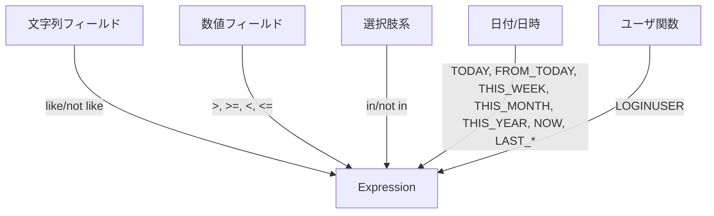

# クエリビルダー ガイド

## FP API（推奨）

```ts
import {
  createQueryState,
  setWhere,
  appendOrder,
  withLimit,
  withOffset,
  setValidationOptions,
  build,
} from 'kintone-as-code';
import { and } from 'kintone-as-code';
import { QueryFields } from '../apps/customer-app.query';

const { 会社名, 売上高, ステータス } = QueryFields;

const q = build(
  setValidationOptions({ maxDepth: 5, maxLength: 10000 })(
    withOffset(0)(
      withLimit(100)(
        appendOrder(
          '売上高',
          'desc'
        )(
          setWhere(
            and(
              会社名.like('*サイボウズ*'),
              売上高.greaterThan(1000000),
              ステータス.in(['商談中', '受注'])
            )
          )(createQueryState())
        )
      )
    )
  )
);
```

## OOファサード（互換）

```ts
import { createQuery } from '../apps/customer-app.query';
import { and } from 'kintone-as-code';
import { QueryFields } from '../apps/customer-app.query';

const { 会社名, 売上高, ステータス } = QueryFields;

const q = createQuery()
  .setValidationOptions({ maxDepth: 5 })
  .where(
    and(
      会社名.like('*サイボウズ*'),
      売上高.greaterThan(1000000),
      ステータス.in(['商談中', '受注'])
    )
  )
  .orderBy('売上高', 'desc')
  .limit(100)
  .offset(0)
  .build();
```

## 機能の対応表（抜粋）



## 補助メソッド

- 文字列: `contains()/startsWith()/endsWith()`
- 数値/日付/日時/時間: `between(min, max)`
- 関数（未サポート名）: `customDateFunction(name, ...args)` / `customUserFunction(name, ...args)`

## サブテーブル/関連レコードの扱い

- `--include-subtable` を指定すると、サブテーブルの子フィールドを `createTableSubField('親.子')` で最小API（`in/not in` のみ）として公開します。
- `--include-related` を指定すると、関連レコード（`REFERENCE_TABLE`）の `displayFields` を同様に最小APIとして公開します。
- 明示的に `--include-subtable=false` の場合、サブテーブルは生成物から完全に除外され、警告コメントも出しません。

## 未サポートフィールド

以下のフィールドタイプはクエリでは非対応のため、生成器は出力から除外します（`SUBTABLE` は上記のとおりオプションで扱いが変わります）。

- 例: `FILE`, `CATEGORY`, `STATUS`, `STATUS_ASSIGNEE`, `CREATED_TIME`, `UPDATED_TIME`, `CREATOR`, `MODIFIER`, `RECORD_NUMBER`, `GROUP`, `SPACER`, `LABEL`, `REFERENCE_TABLE`（関連は `--include-related` で最小公開）

除外時は、警告コメント `// フィールドコード: TYPE type is not supported` を出力します（`--include-subtable=false` のときの `SUBTABLE` はコメントも抑制）。

## raw() の非提供について

生クエリを挿入する `raw()` は提供しません。代替として以下を利用できます。

- 文字列: `contains/startsWith/endsWith`
- 数値/日付/時間: `between(min, max)`
- 名前での関数指定: `customDateFunction(name, ...args)` / `customUserFunction(name, ...args)`
