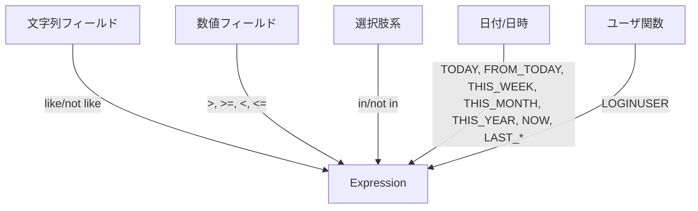

# クエリビルダー ガイド

## FP API（推奨）

```ts
import {
  createQueryState,
  setWhere,
  appendOrder,
  withLimit,
  withOffset,
  setValidationOptions,
  build,
} from 'kintone-as-code';
import { and } from 'kintone-as-code';
import { QueryFields } from '../apps/customer-app.query';

const { 会社名, 売上高, ステータス } = QueryFields;

const q = build(
  setValidationOptions({ maxDepth: 5, maxLength: 10000 })(
    withOffset(0)(
      withLimit(100)(
        appendOrder(
          '売上高',
          'desc'
        )(
          setWhere(
            and(
              会社名.like('*サイボウズ*'),
              売上高.greaterThan(1000000),
              ステータス.in(['商談中', '受注'])
            )
          )(createQueryState())
        )
      )
    )
  )
);
```

## OOファサード（互換）

```ts
import { createQuery } from '../apps/customer-app.query';
import { and } from 'kintone-as-code';
import { QueryFields } from '../apps/customer-app.query';

const { 会社名, 売上高, ステータス } = QueryFields;

const q = createQuery()
  .setValidationOptions({ maxDepth: 5 })
  .where(
    and(
      会社名.like('*サイボウズ*'),
      売上高.greaterThan(1000000),
      ステータス.in(['商談中', '受注'])
    )
  )
  .orderBy('売上高', 'desc')
  .limit(100)
  .offset(0)
  .build();
```

## 機能の対応表（抜粋）



## 補助メソッド

- 文字列: `contains()/startsWith()/endsWith()`
- 数値/日付/日時/時間: `between(min, max)`
- 関数（未サポート名）: `customDateFunction(name, ...args)` / `customUserFunction(name, ...args)`
